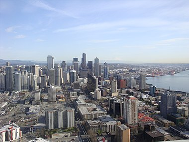

# GEOG 458: Group AB5 Final Project

### Seattle Transportation Over Time

project significance and broader impacts:

primary functions and major data sources:
- Gas Prices by Time: https://datahub.io/core/natural-gas#readme 

- 2018 Seattle Traffic Count: https://data-seattlecitygis.opendata.arcgis.com/datasets/SeattleCityGIS::2018-traffic-flow-counts/explore?location=47.619630%2C-122.338100%2C12.00 

- (2007-18) Feature Layers: https://data-seattlecitygis.opendata.arcgis.com/search?sort=name&tags=flow%2Ctraffic&type=feature%20layer 

- King County Metro Routes and Transit Centers: https://gis-kingcounty.opendata.arcgis.com/search?q=King%20County%20Metro%20Routes 

targeted audience:
Communities in the Seattle area, specifically commuters who drive their own vehicles as well as those who utilize public transportation.

multimedia (e.g., external links, texts, images, youtube videos, etc.):
Information about traffic in the Seattle area and how the downtown area has developed (i.e. growth of tech companies downtown like Amazon). Photos and video of traffic in the area, such as on I-5.

Seattle skyline in 2005

project format: option two: Smart dashboard

How to arrange all the components on the graphical user interface (GUI)?
What are the coordinated charts you plan to make?
i. javascript that supports the making of a chart.
ii. type of chart (e.g., line, bar, pie, etc.)
iii. data attributes to be visualized.
