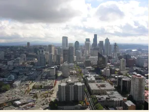

# GEOG 458: Group AB5 Final Project

## Seattle Transportation Over Time

### Project Significance and Broader Impacts:
The project highlights the function of traffic in Seattle. The target audience of this project is the people of Seattle, especially commuters. Therefore, the intended audience most likely already have a good understanding that traffic in big cities can be congested and plays a big role in the commutes of those living in the city. As a result, the intended audience also is aware that gas can be pretty expensive, and there are significant environmental effects from large amounts of vehicle commuters. This project shows exactly how these things are occurring, utilizing both historical data to analyze traffic trends and year-to-date differences, as well as real-time data that can be utilized by the average person to know where the current most congested areas are. As far as potentially negative broader impacts of this project, it’s a little hard to say exactly. In general, there has been a bigger push to lean more towards public transport and shift away from the car dependency that the US has, and this project fits into that as the issue of intense city traffic is alleviated as more public transportation and infrastructure is implemented. One issue that has occurred from that is the placement of public transport stations. There is a proposed link station in the International District of Seattle that would displace long-standing businesses in the area. So, vulnerable areas without much of a voice can be left damaged as we push more towards changes in how transportation is working. As such, it is important to consider how we continue to shift to a more sustainable transportation future in cities, as we want to preserve the areas of importance to the people living there.

### Primary Functions and Major Data Sources:
Our primary function for this project is to create a resource that tracks Seattle traffic over time in order to allow for historical and real-time analysis. This dashboard will allow the user to see how traffic in Seattle has changed over the last few years, over the Covid-19 pandemic, and how it changes during the day. This resource is made possible by the data from WSDOT and King County, which are the two primary sources. All of our sources, however, are linked below:

- [Gas Prices by Time](https://www.eia.gov/dnav/pet/hist/LeafHandler.ashx?n=pet&s=emm_epmru_pte_y48se_dpg&f=m)

- [2018 Seattle Traffic Count](https://data-seattlecitygis.opendata.arcgis.com/datasets/SeattleCityGIS::2018-traffic-flow-counts/explore?location=47.619630%2C-122.338100%2C12.00)

- {(2007-18) Feature Layers](https://data-seattlecitygis.opendata.arcgis.com/search?sort=name&tags=flow%2Ctraffic&type=feature%20layer) 

- [King County Metro Routes and Transit Centers](https://gis-kingcounty.opendata.arcgis.com/search?q=King%20County%20Metro%20Routes)

### Target Audience:
As previously stated, the target audience of this project is the people of Seattle, especially commuters, including both those who use their own vehicles as well as those who use public transportation.

### Multimedia (e.g., external links, texts, images, youtube videos, etc.):
Information about traffic in the Seattle area and how the downtown area has developed (i.e. growth of tech companies downtown like Amazon). Photos and video of traffic in the area, such as on I-5.

Seattle skyline in 2005

### Project format: option two: Smart dashboard
For our project, we will be using the EPSG:3857 projection. We will have four zoom levels, and it will be centerd on the City of Seattle, as that is the focus of our project. We want to provide the ability to zoom in order to provide more localized data for the user. Our basemap will include streets and buildings, in order to be the most commuter-friendly. We will also add thematic layers that include natural fixtures such as water, as well as highlighting infrastructure such as bridges, bus stops, and link stations. These thematic layers will ensure it is appropriate for our intended audience. We will be using a proportional symbol and color coded map in order to differentiate traffic congestion and the necessary locations and symbols. The data for these locations can be found here, [provided by Sound Transit](https://www.soundtransit.org/get-to-know-us/maps). Much of this data is available as vectors, such as specific geometry, polygons, and lines that represent the traffic and specific routes in the Seattle area.

When planning our project interface, we wanted to balance all of the visuals with pertinent information on the dashboard, to make it visually appealing and easy to understand as a first-time user. We also wanted to make the most important information stand out, with the ability to dive deeper into the interface if more information were to be desired by the user. Therefore, we wanted to create charts that showcase year-to-date data and real-time data that are easy to understand immediately, as well as graphs that can be narrowed down more specifically to areas of Seattle. We will primarily be using bar charts to showcase the breakdown of traffic in Seattle, with other supporting maps and charts. For instance, we can use maps to visualize geographically the different trends in different neighborhoods and areas. As an example, we can identify key areas of development, such as along the Northgate Link expansion, and track how traffic has changed along that corridor.
